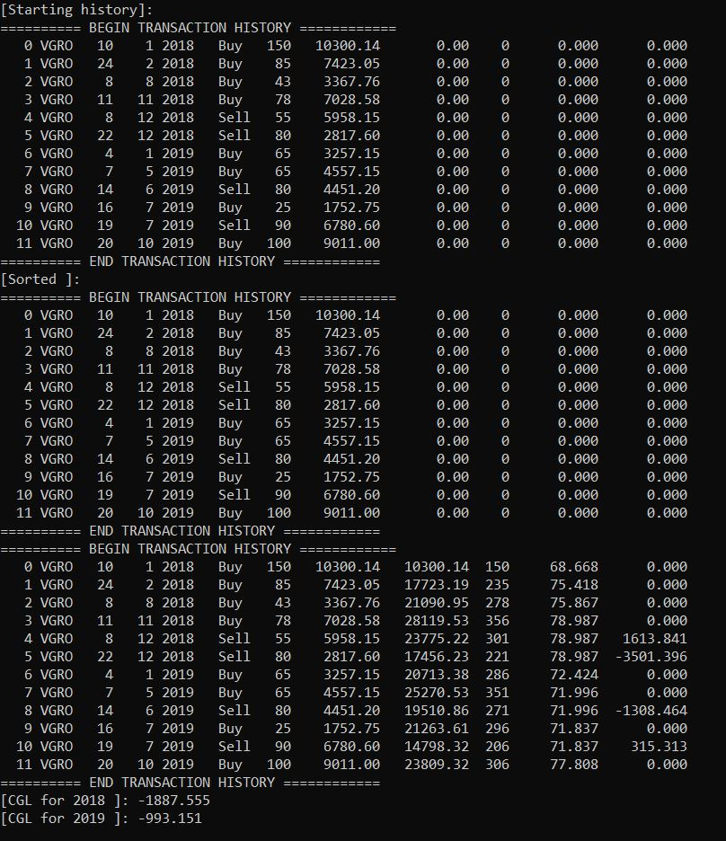

# Automatic-Capital-Gains-Classifier
ETF activity documentation code that implements adjusted cost base (ACB) reporting for capital gain/loss of portfolio. 

**Example of how program will look like when ran

